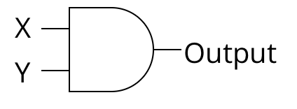
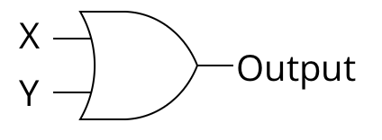
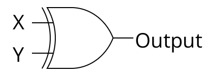
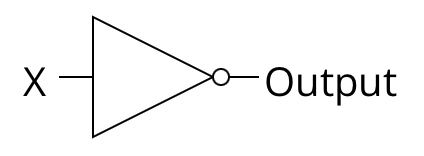
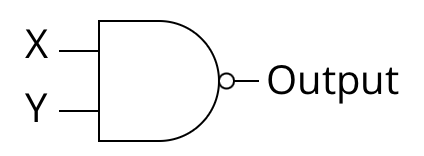
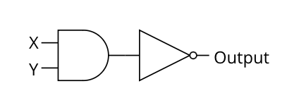
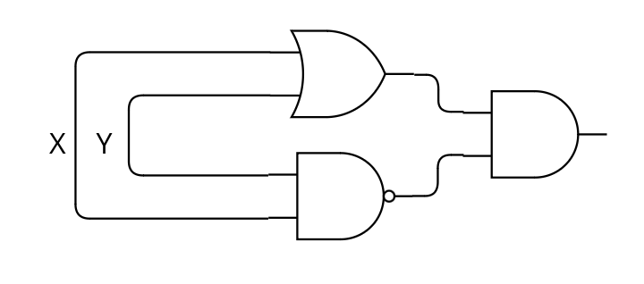
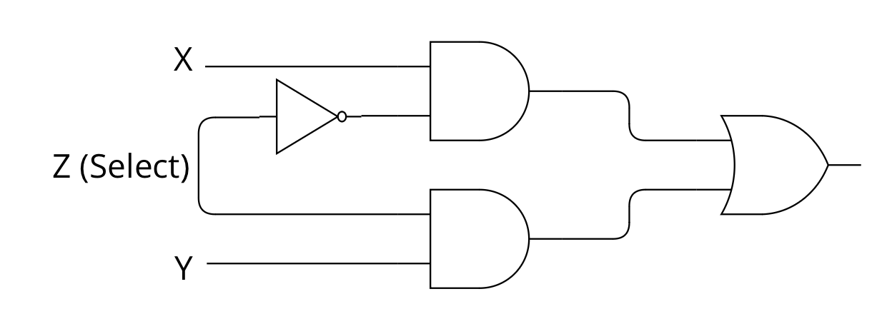

<html>
	<head>
	    <!-- Include MathJax script -->
		
	</head>
	<a style="margin-bottom:5px" href="/cpu_tutorial">< Go Back</a>
	

</html>

# Chapter 06 - Logic Gates
**Topics Covered:** AND, OR, NOT, XOR, NAND, The Universal Gate, Truth Tables

Now that I've made you suffer through enough chapters of binary, it's time to introduce a seperate yet similarly related concept: logic gates. There a few different types of logic gates we will need to understand, so I will introduce them one-by-one and then we will circle back and understand the bigger picture. This chapter should (hopefully) be a lighter read compared from the last few which probably involved you using a calculator to double check everything I was saying.

Simply put, a logic gate takes in a variable number of inputs (atleast 1) and produce a single output. The interesting part, that that all the inputs and outputs are either 0's or 1's. We have spent a few painful chapters understanding the nuances of binary, but you can put that aside for this chapter. In the next chapter, the connection between this chapter and all the previous ones will become apparent.

Let's start with the AND gate which takes in two inputs, and produces one output. If both of the inputs are 1, then the output of the AND gate is 1. For any other combination of inputs, the output will be a zero. The following image is what an AND gate looks like: X and Y serve as the two inputs and the output is given on the right hand side.

Recall that, in the picture above, X and Y are binary inputs. So X can be either 0 or 1 just as Y can be either 0 or 1. We know that the only time that Output=1 is when $X=1$ and $Y=1$. Another way to view the functionality of the gate is by giving a **truth table**. A truth table is a table (duh) that enumerates all of the different possible input combinations on the rows while providing the output of the logic gate on the right-most column. See the table below. There are only four rows in this table, because with two binary inputs, there are only four different input combinations (try invent another one if you don't believe me).

**AND Gate Truth Table:**

| X | Y | AND |
|---|---|---|
| 0 | 0 |  0 |
| 0 | 1 |  0 |
| 1 | 0 |  0 |
| 1 | 1 |  1 |

Now, lets move on to the OR gate which also takes in two inputs. The difference here is that this gate will output a 1 whenever atleast 1 of the inputs is 1. If both of the inputs are a one, the output of the gate will still be 1. It also does not matter which of the inputs is 1, the output will be 1 as long as either of the gates is 1. With this information, we can reason that the only time an OR gate will ever output a 0 is if both of the inputs are 0's. Here's what an OR gate with inputs named X and Y looks like:

Just as we gave a truth table for the AND gate, below is the truth table for an OR gate.

**OR Gate Truth Table:**

| X | Y | OR |
|---|---|---|
| 0 | 0 |  0 |
| 0 | 1 |  1 |
| 1 | 0 |  1 |
| 1 | 1 |  1 |

**XOR Gate Truth Table:**

Similar to the OR gate is the XOR gate which means "Exclusive OR". The difference between this gate and the regular OR gate is that this will only output a 1 if exactly 1 of the inputs is 1. So, if both of the inputs are 1's, then the gate will output a zero. Besides this, the other three rows in the truth table remain unaffected. A picture of the gate and truth table are given below.

| X | Y | XOR |
|---|---|---|
| 0 | 0 |  0 |
| 0 | 1 |  1 |
| 1 | 0 |  1 |
| 1 | 1 |  0 |

**NOT Gate Truth Table:**
The NOT gate, sometimes called an inverter, is different than the rest we have considered so far because it only takes in one input. Since there is one input and the input is binary, we know that the truth table will only have two rows to represent the two sole possible input values. The inverter will output the inverse of the input. So, 1's become 0's and vice versa. Below is an image of an inverter followed by its corresponding truth table.

| X | NOT |
|---|---|
| 0 | 1 |
| 1 | 0 |

**NAND Gate Truth Table:**

Now we move onto the the NAND gate which, in English, reads "Not AND". This gate will take whatever the output is of the AND gate and invert it. The NAND gate will output a 1 unless both inputs are 1's in which case it will output a zero. This means the the truth table will be the exact opposite of the AND gate's truth table. The diagram and truth table are given below.

| X | Y | NAND |
|---|---|---|
| 0 | 0 |  1 |
| 0 | 1 |  1 |
| 1 | 0 |  1 |
| 1 | 1 |  0 |

What's interesting is that the NAND gate can be constructed by taking a regular and gate and then feeding the input through a NOT gate. This is entirely valid, we can chain logic gates together to build more powerful circuits. So, this circuit below is functionally equivalent to a NAND gate.

Similarly, we can construct the XOR gate with the following combination of other logic gates.

This one is a little bit harder to understand. The easiest option is to create a truth table for this circuit and then compare it against the truth table for the XOR gate to see that they always output the same value for any input. If you're like me, this alone won't satisfy you since you want an intuitive explanation. Here is how I would reason through this: the circuit ends with an AND gate which means it only outputs a 1 when both of the inputs are 1's. How do we make the first input a 1? The first input to the AND gate will be a one whenever X or Y is true since the input to the AND gate is the output of an OR gate. How do we make the second input to the AND gate a 1? We make the output of the NAND gate a 1. This happens as long as the inputs are not both 1. So we know the two conditions, and we need them to be true simultaneously. So putting this together, we can reason that the circuit will only output a 1 if "atleast X or Y is a 1 BUT not both of them are 1". And this is exactly how we described the XOR gate!

These few logic gates may seem very simple to understand compared to binary, but it turns out they can be chained together to do some pretty interesting things. Consider the circuit below with three inputs which, at first glance, probably looks like gibberish. But if you make a truth table for it, you will see that the circuit is a switch. Whenever Z is 0 the gate outputs whatever the value of X is. Whenever Z is 0, the gate outputs whatever the value of Y is. So, Z is effectively switching the output between X and Y. Pretty neat! The truth table has been given below, but you should try complete it on your own. 

| X | Y | Z | Output |
|---|---|---|---|
| 0 | 0 |  0 | 0 |
| 0 | 0 |  1 | 0 |
| 0 | 1 |  0 | 1 |
| 0 | 1 |  1 | 0 |
| 1 | 0 |  0 | 0 |
| 1 | 0 |  1 | 1 |
| 1 | 1 |  0 | 1 |
| 1 | 1 |  1 | 1 |

Abstract gates can be built physically
Claim: Computers are made of logic gates (logic gates as the building block). There are still other gates though we just dont need them
Determinism
